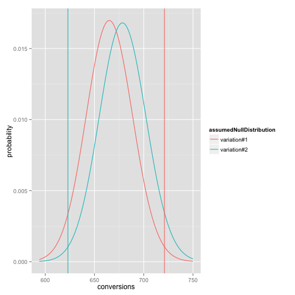

```r
# R example working a rate significance test related to the problem stated in http://blog.sumall.com/journal/optimizely-got-me-fired.html
# See: http://www.win-vector.com/blog/2014/05/a-clear-picture-of-power-and-significance-in-ab-tests/ for more writing on this
# Note: we are using exact tail-probability from the binomial distribution exactly.   This is easy
# to do (as it is a built in function in many languages) and more faithful to the underlying
# assumed model than using a normal approximation (though a normal approximation is certainly good enough).

# to rebuild
# echo "library(knitr); knit('rateTestExample.Rmd')" | R --vanilla ; pandoc rateTestExample.md -o rateTestExample.html

# type in data
d <- data.frame(name=c('variation#1','variation#2'),visitors=c(3920,3999),conversions=c(721,623))
d$rates <- d$conversions/d$visitors
print(d)
```

```
##          name visitors conversions  rates
## 1 variation#1     3920         721 0.1839
## 2 variation#2     3999         623 0.1558
```

```r
# for our null-hypothesis assume the two rates are identical.
# under this hypothesis we can pool the data to get an estimate of what
# common rate we are looking at.
baseRate <- sum(d$conversions)/sum(d$visitors)
print(baseRate)
```

```
## [1] 0.1697
```

```r
# write down how far the observed counts are from the expected values
d$expectation <- d$visitors*baseRate
d$difference <- d$conversions-d$expectation

# compute the one and two-sided significances of this from a Binomial model
# return p( lowConversions <= conversions <= highConversions | visitors,rate)
pInterval <- function(visitors,rate,lowConversions,highConversions) {
  # pbinom(obs,total,rate) = P[obs <= total | rate]
  pbinom(highConversions,visitors,rate) - 
     pbinom(lowConversions-1,visitors,rate)
}
d$pAtLeastAbsDiff <- 1 - pInterval(d$visitors,baseRate,
   d$expectation-(abs(d$difference)-1),
   d$expectation+(abs(d$difference)-1))

# also show estimate of typical deviation and z-like score
d$expectedDeviation <- sqrt(baseRate*(1-baseRate)*d$visitors)
d$Z <- abs(d$difference)/d$expectedDeviation

print(d)
```

```
##          name visitors conversions  rates expectation difference
## 1 variation#1     3920         721 0.1839       665.3       55.7
## 2 variation#2     3999         623 0.1558       678.7      -55.7
##   pAtLeastAbsDiff expectedDeviation     Z
## 1         0.01821             23.50 2.370
## 2         0.02051             23.74 2.347
```

```r
# plot pooled rate null-hypothesis
library(ggplot2)
library(reshape2)
plotD <- data.frame(conversions=
   (floor(min(d$expectation) - 3*max(d$expectedDeviation))):
   (ceiling(max(d$expectation) + 3*max(d$expectedDeviation))))
plotD[,as.character(d$name[1])] <- dbinom(plotD$conversions,d$visitors[1],baseRate)
plotD[,as.character(d$name[2])] <- dbinom(plotD$conversions,d$visitors[2],baseRate)


thinD <- melt(plotD,id.vars=c('conversions'),
   variable.name='assumedNullDistribution',value.name='probability')
# In this plot the two distributions are assumed to have the same
# conversion rate, so the only distributional difference is from the
# different total number of visitors.  The vertical lines are the
# observed conversion counts for each group.
ggplot(data=thinD,aes(x=conversions,y=probability,color=assumedNullDistribution)) + 
   geom_line() + geom_vline(data=d,aes(xintercept=conversions,color=name))
```

 
